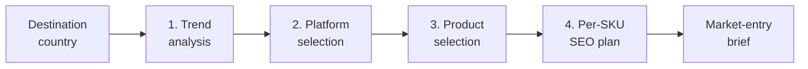

# Cross-Border E-Commerce Analyst

An AI agent that tells a China-based seller how to enter a foreign market — backed by live search, marketplace, and social data instead of generic advice.

You give it one thing: **a destination country.** It returns a market-entry brief you can act on.

---

## What it answers

| # | The seller's question | What the agent returns |
|---|---|---|
| 1 | *Is there demand here?* | Trend analysis — which categories are rising or falling, demand curves over time, who buys (age/gender), and which regions of the country search most |
| 2 | *Where should I sell?* | Ranked marketplace recommendation, justified by each platform's organic traffic and who actually dominates local shopping search results |
| 3 | *What should I sell?* | Specific product niches, each weighed on real demand against real competition, plus why Chinese supply has an edge |
| 4 | *How do buyers find me?* | A per-SKU keyword plan: primary and secondary keywords with search volume and difficulty, listing titles in the local language, and backend search terms |

Ask for one of these, or ask for all four and get the full brief.

---

## How it thinks



Each phase runs a defined research playbook rather than improvising. The trend phase must corroborate a finding across at least three independent sources — social trending, search demand, news velocity, community discussion — before calling a direction. The platform phase proposes candidate marketplaces, then confirms them against traffic and search-result evidence. The SEO phase only recommends a keyword once real volume and difficulty data comes back for it.

## The rules that make it trustworthy

- **Evidence over guesses.** Search volumes, difficulty scores, prices, and trend directions come from data calls only. The agent is instructed never to invent a number.
- **Local language first.** Research runs in the market's own language, because that's where the real search demand lives — English keyword volume in a non-English market is usually a rounding error.
- **It names what it doesn't know.** Every brief ends with a data-gaps section listing which sources returned nothing, so you know which conclusions are thin.
- **Decision-ready, not raw.** Output is ranked recommendations with the supporting evidence attached — not a dump of API responses.

## What it can and can't see

| Well covered | Partial | Not covered |
|---|---|---|
| Google search demand, keyword difficulty, and live search results for virtually any country; Amazon and Google Shopping product listings; social, news, and community signals | Amazon keyword data varies by market — US coverage is strongest, some markets are missing entirely and fall back to US figures as a labelled proxy | Structured product data for TikTok Shop, eBay, Etsy, Shopee, and Mercado Libre; unit-sales estimates (demand is inferred from search volume, rank, and review counts) |

The agent labels findings about uncovered platforms as qualitative rather than presenting them as measured.

---

## See a real output

A full brief the agent produced for **porcelain into South Korea** — market sizing, four platforms compared, five product niches, and five per-SKU SEO plans:

- [English](./reports/korea-porcelain-market-entry.md)
- [简体中文](./reports/korea-porcelain-market-entry.zh-CN.md)

---

## Try it in 5 minutes

**You'll need** Node.js 24+ and an AIsa API key — sign up at [aisa.one](https://aisa.one) (new accounts start with free credit).

**1. Install**

```bash
npm install
```

**2. Add your credentials** to a `.env` file in the project root:

```bash
AISA_API_KEY=your-aisa-api-key
AISA_BASE_URL=https://api.aisa.one/v1
AISA_DATA_BASE_URL=https://api.aisa.one/apis/v1
```

**3. Start the agent**

```bash
npm run dev
```

**4. Ask it something.**  Try:

> I want to sell porcelain to South Korea — give me a full market-entry brief.

> What's trending in home fitness in Brazil right now?

> Which marketplaces should I use to sell kitchen gadgets in Germany?

> Build an SEO plan for a stainless steel water bottle in Japan.

A full four-part brief takes a few minutes and makes a few dozen data calls — the agent narrates each step as it goes. Narrower questions return much faster.

---

## Documentation

This agent is built on the **eve** framework and runs entirely on the **AIsa** unified API.

| | |
|---|---|
| eve framework | [eve.dev/docs](https://eve.dev/docs) — agents, tools, skills, connections, deployment |
| AIsa platform | [aisa.one/docs](https://aisa.one/docs) — models, data APIs, and agent skills |
| AIsa API reference | [aisa.one/docs/api-reference](https://aisa.one/docs/api-reference) — every endpoint the agent draws on |

Deploy it with `/deploy` from the eve dev session, or see the eve deployment docs.

---

<sub>Market figures produced by this agent are point-in-time estimates. Validate before committing capital.</sub>
